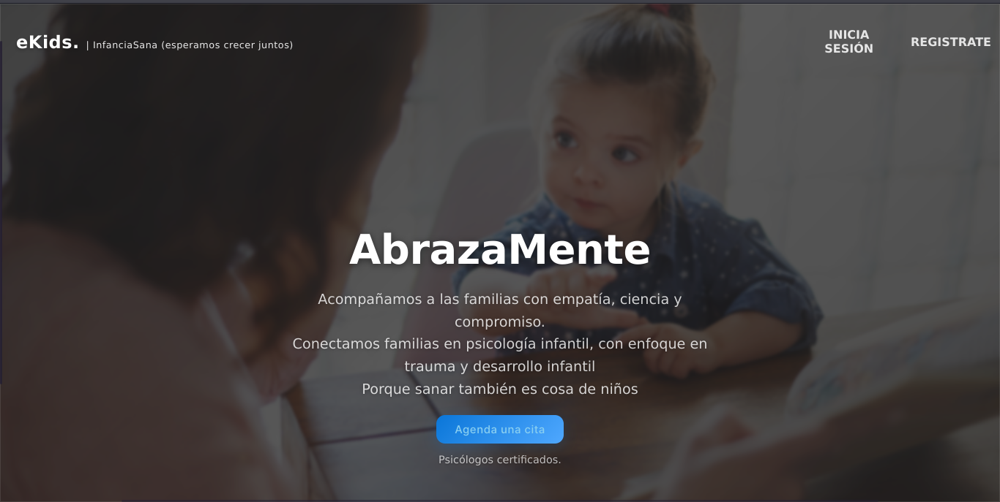

# 🧠 AbrazaMente — Sistema de Gestión de Citas Psicológicas

<div align="center">



**Sistema web para gestionar citas y sesiones en un consultorio psicológico**  
*Desarrollado por Equipo 7 — Sección 5CM51*

[](https://www.php.net/) [](https://www.docker.com/) [](https://mariadb.org/) [](./LICENSE)

</div>

---

## 📌 Índice
- [Descripción](#-descripción)
- [Demo / Capturas](#-demo--capturas)
- [Características](#-características)
- [Tecnologías](#-tecnologías)
- [Instalación rápida (Docker)](#-instalación-rápida-docker)
- [Configuración / Variables de entorno](#-configuración--variables-de-entorno)
- [Credenciales de ejemplo](#-credenciales-de-ejemplo)
- [Estructura de la base de datos (resumen)](#-estructura-de-la-base-de-datos-resumen)
- [Buenas prácticas de seguridad](#-buenas-prácticas-de-seguridad)
- [Cómo actualizar este README y desplegar (consola)](#-cómo-actualizar-este-readme-y-desplegar-consola)
- [Mejoras sugeridas (estética y técnica)](#-mejoras-sugeridas-estética-y-técnica)
- [Equipo](#-equipo)
- [Licencia](#-licencia)
- [Soporte](#-soporte)

---

## 📝 Descripción
AbrazaMente es una aplicación web para gestionar citas, sesiones y el historial de pacientes en un consultorio psicológico. Diseñada para funcionar con PHP/Apache, MariaDB y contenerizada con Docker Compose.

---

## 🎬 Demo / Capturas
> Inserta aquí un GIF corto de flujo: reservar una cita → confirmación → ver en admin.  
Capturas (ejemplos):
!(./capturas/Portada.png)

- `./capturas/ejemploAdmin.png`  
- `./capturas/phpadmin.png`

*(Asegúrate de optimizar las imágenes y añadir `alt` descriptivos.)*

---

## 🚀 Características principales
- Roles: **Administrador**, **Especialista/Doctor**, **Paciente**
- Reserva de citas por especialidad y control de cupos
- Gestión de sesiones (schedules) y visualización por calendario
- CRUD de especialistas y pacientes
- Numeración automática y confirmaciones de reserva
- Autenticación basada en sesiones PHP

---

## 🧩 Tecnologías
- Backend: PHP 7.4+ (Apache)
- Base de datos: MariaDB 10.5
- Contenedores: Docker, Docker Compose
- Frontend: HTML5, CSS3, JavaScript (vanilla)
- Recomendado: migrar a PHP 8.x para soporte y seguridad

---

## 🐳 Instalación rápida (Docker)

**Requisitos**: Docker, Docker Compose, Git

```bash
# 1) Clonar repo
git clone https://github.com/J0VAN1/AbrazaMente.git
cd AbrazaMente

# 2) Crear archivo de entorno (copiar ejemplo)
cp .env.example .env   # editar .env según sea necesario

# 3) Levantar contenedores (reconstruir)
docker-compose up -d --build

# Accesos típicos
# App:       http://localhost:8080
# phpMyAdmin: http://localhost:8081
# MariaDB:   puerto 3306 (interno)
