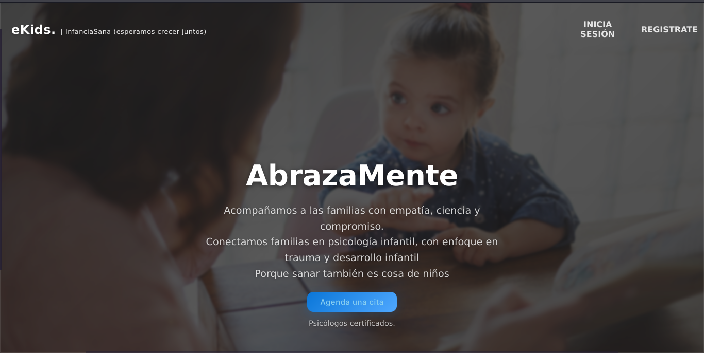

# 🧠 AbrazaMente — Sistema de Gestión de Citas Psicológicas

<div align="center">



**Sistema web para gestionar citas y sesiones en un consultorio psicológico**  

[](https://www.php.net/) [](https://www.docker.com/) [](https://mariadb.org/) [](./LICENSE)

</div>

---

## 📌 Índice
- [Descripción](#-descripción-principales)
- [Características](#-características)
- [Tecnologías](#-tecnologías)
- [Credenciales de ejemplo](#-credenciales-de-prueba)
- [Instalación rápida (Docker)](#-instalación-rápida-docker)


---

## 📝 Descripción
AbrazaMente es una aplicación web para gestionar citas, sesiones y el historial de pacientes en un consultorio psicológico. Diseñada para funcionar con PHP/Apache, MariaDB y contenerizada con Docker Compose.

---


## 🚀 Características principales
- Roles: **Administrador**, **Especialista/Doctor**, **Paciente**
- Reserva de citas por especialidad y control de cupos
- Gestión de sesiones (schedules) y visualización por calendario
- CRUD de especialistas y pacientes
- Numeración automática y confirmaciones de reserva
- Autenticación basada en sesiones PHP

---

## 🧩 Tecnologías
- Backend: PHP 7.4+ (Apache)
- Base de datos: MariaDB 10.5
- Contenedores: Docker, Docker Compose
- Frontend: HTML5, CSS3 (vanilla)

---
## 🔐 Credenciales de prueba 

- Admin: admin@ipn.com
- / 123

- Doctor: especialista@ipn.com
- / 123

- Paciente: paciente@ipn.com
- / 123: patient@edoc.com

---

## 🐳 Instalación rápida (Docker)

**Requisitos**: Docker, Docker Compose, Git

```bash
# 1) Clonar repo
git clone https://github.com/J0VAN1/AbrazaMente.git
cd AbrazaMente

# 2) Levantar contenedores (reconstruir)
docker compose up -d --build

